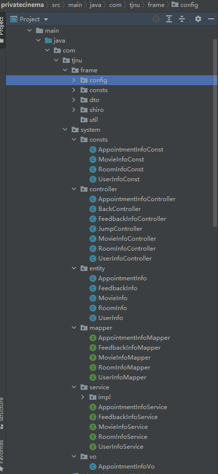
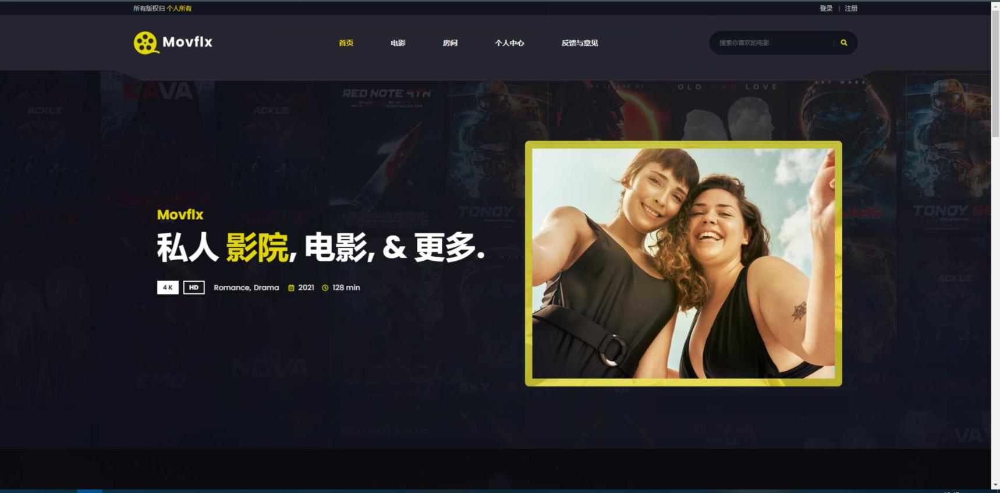
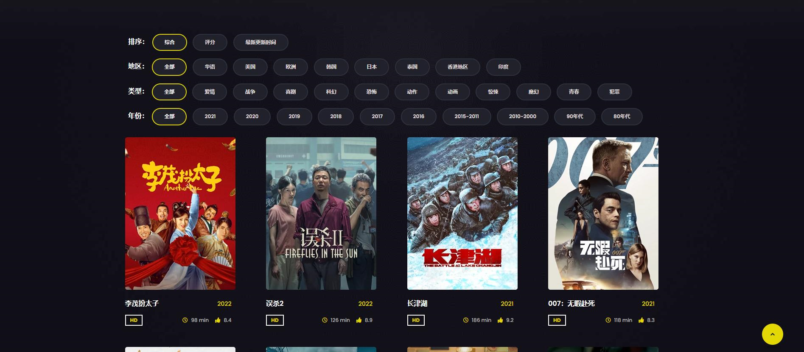
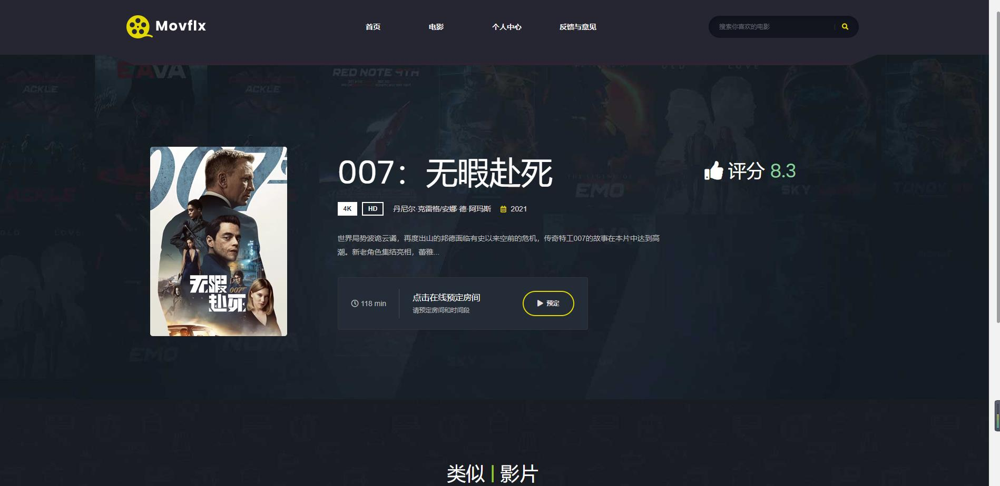
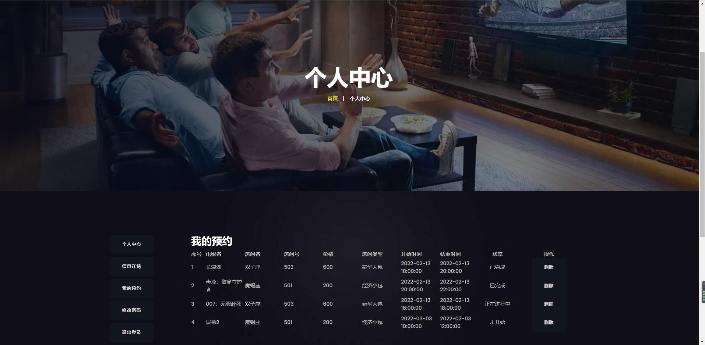
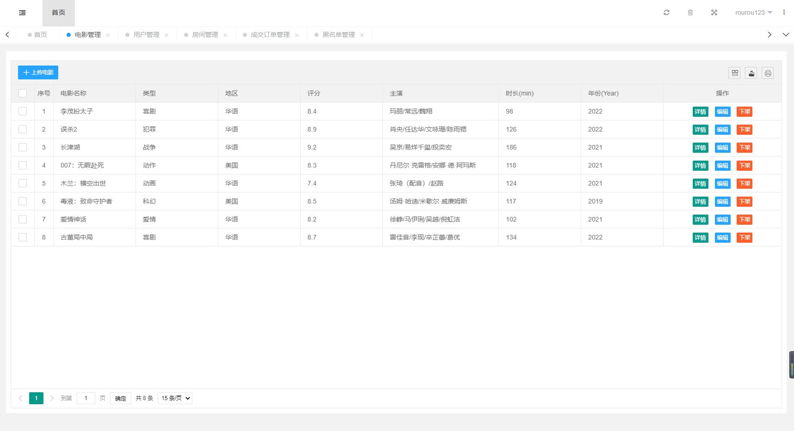

# 基于SpringBoot+MyBatis的私人影院项目

 该项目设计了基于SpringBoot+Mybatis框架的私人影院预约系统，包含Mybatis、Springboot、Shiro、MD5、Thymeleaf、MySQL、Layui等相关技术。编程语言使用java。后端使用的SpringBoot框架，它具有简化依赖、简化配置、简化部署、简化监控等优点。

后台管理框架使用了Layuimiini+Mybatis

数据库MySQL中不仅包含简单的增删改查功能，还包含了海量电影信息，以及用户和商家的信息。

项目目录结构：

## 前台主页

## 电影列表

## 详情页

## 个人中心

## 后台管理

